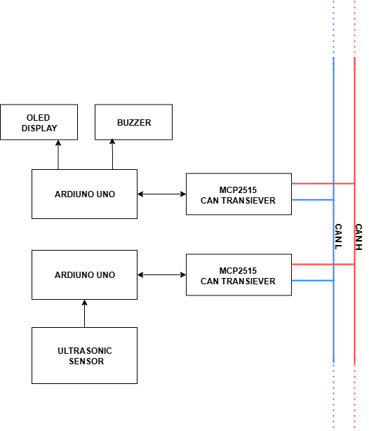
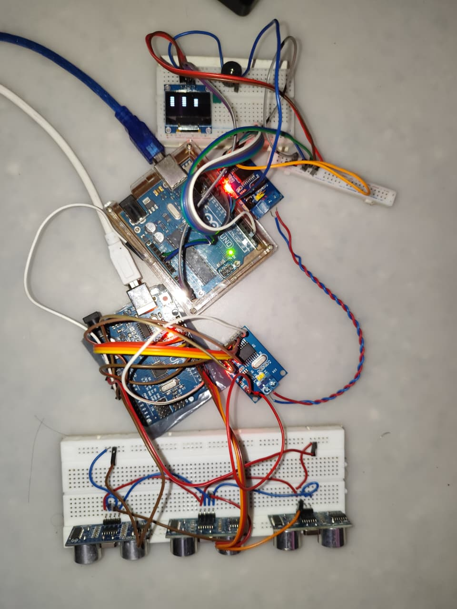
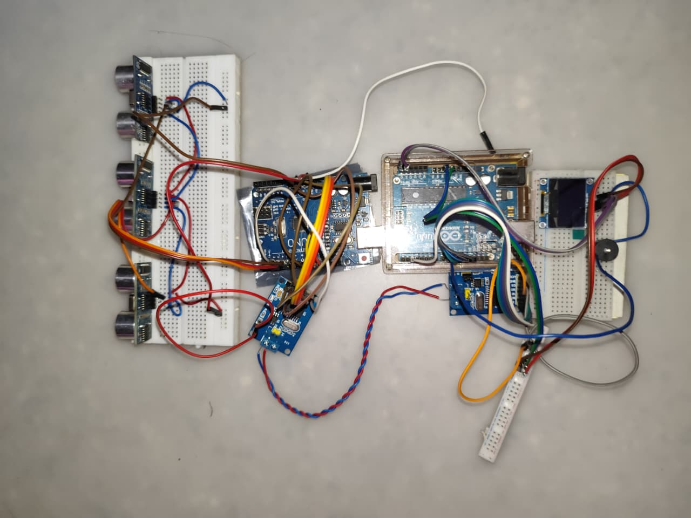

# Reverse Guidance System for Automobiles using CAN Protocol

This project presents an Arduino-based reverse parking assistance system for older vehicles that lack modern parking sensors. It uses the Controller Area Network (CAN) protocol to enable real-time communication between two modules: a **Sensor Node** and a **Display Node**.

The system provides both **visual (OLED)** and **auditory (buzzer)** alerts based on obstacle proximity using HC-SR04 ultrasonic sensors.

---

## System Overview



- **Sensor Node**:
  - 3 × HC-SR04 ultrasonic sensors
  - Arduino UNO
  - MCP2515 CAN controller
- **Display Node**:
  - Arduino UNO
  - MCP2515 CAN controller
  - OLED 0.96" display
  - Buzzer

Communication is done over a **twisted-pair CAN Bus at 125 kbps**.

---

## Hardware Connections

### Sensor Node:
- HC-SR04 sensors → Digital I/O pins
- MCP2515 (SPI):
  - MOSI → D11
  - MISO → D12
  - SCK  → D13
  - CS   → D10
- CAN H/L lines → twisted pair with 120Ω termination

### Display Node:
- OLED (I2C):
  - SDA → A4
  - SCL → A5
- Buzzer → Digital output pin
- MCP2515 connected as above

Ensure both nodes share a **common GND** and 5V supply.

---

## Setup Instructions

1. Clone the repository:

```bash
git clone git@github.com:Amazing-Stardom/arduino-reverse-car-can-system.git
````

2. Open Arduino IDE and install:

   * `mcp_can` library
   * `Adafruit_SSD1306` and `Adafruit_GFX` libraries

3. Upload the correct sketch:

   * `sender_node.ino` to the Sensor Node
   * `display_node.ino` to the Display Node

4. Power both Arduinos. The system will automatically start sending and displaying proximity data.

---

## Demonstration

**Display Output Example**:



**Breadboard Prototype**:



Buzzer beeps faster as the object gets closer. OLED shows increasing vertical bars for proximity.

---

## Code & Folder Structure

```
arduino-reverse-car-can-system/
├── Arduino_Code/
│   ├── display_node/display_node.ino
│   └── sender_node/sender_node.ino
├── img/
│   ├── figure-1.png  → Block Diagram
│   ├── figure-2.jpeg to figure-6.png → Results and Setup
├── reverse-guide-system-for-automobiles-using-can-protocol.docx
└── README.md
```

---


## 📄 Paper

The complete research documentation is available in:

- [`reverse-guide-system-for-automobiles-using-can-protocol.docx`](./reverse-guide-system-for-automobiles-using-can-protocol.docx)


---

## License

* Code: [MIT License](LICENSE)
* Diagrams & Documentation: [CC-BY 4.0](https://creativecommons.org/licenses/by/4.0/)

---

## DOI

This project will be archived on Zenodo for citation.
📌 DOI link: *To be added after upload*


